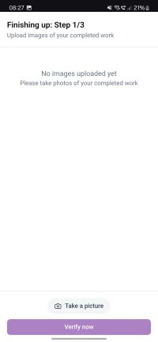
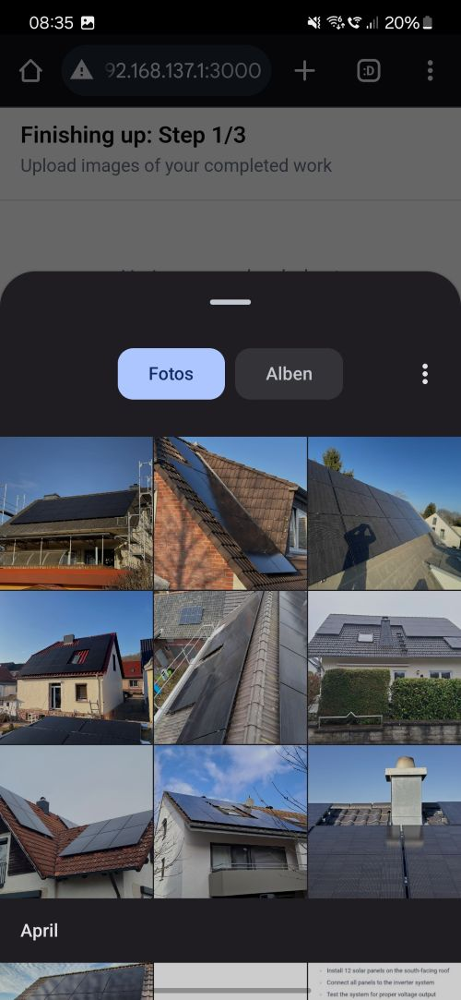
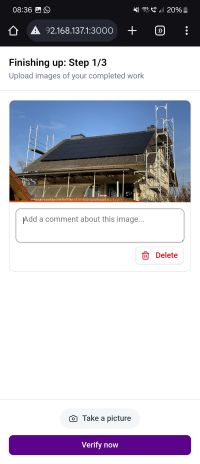
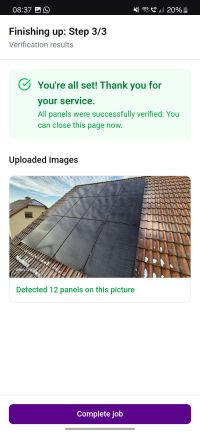
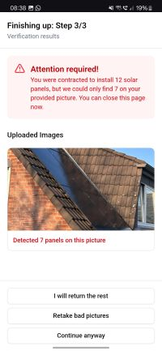

# About the event
The hackathon took place in Hamburg and was hosted by [Chef Treff](https://chef-treff.de/) in April '25.
There were seven companies each providing a challenge that were evenly distributed to all participating teams.
Each team consisting of 3-5 members had 24h to complete their challenge. Each company also provided a contact person.

# About the challenge
Our challenger 1komma5 wants to verify the work of their third party contractors that are installing photovoltaic panels at their customers. For that their contractors need to upload photos of the construction site.
We were challenged to use ai or computer vision to count each photovoltaic panel that can be seen on the given photo.
To round it all up we were requested to develop an app for interacting with our solution.
We were provided a dataset of real world photos labelled with their corresponding panel count.

# Results
We trained our own model that is based on YOLOv8. For that we labelled 130 photos manually where we drew an outline around each pv panel we could see on a photo.  
Here's an example how the model works. On the first picture you can see the input. The second picture you can see what our model could detect.
<p>
    
    
</p>

We also created a Next.js web app where you upload your images. The app then verifies the submission:
<p align="left">
    
    
    
    
    
    
    
</p>


# Project setup
1. Clone this project
```bash
git clone https://github.com/gweiermann/cheftreff-hackathon-2025.git
```
2. Run docker compose
```bash
docker compose up -d
```
3. The app is served at [http://localhost:3000](http://localhost:3000)